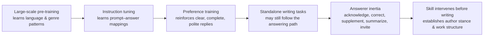

# humanize-writing

> *Make AI write like an author, not a chatbot.*

[中文版](README_zh.md)

---

`humanize-writing` is a writing Skill for local AI tools — Codex, Claude Code, WorkBuddy, TRAE, and others. It adjusts the model's writing path *before* the first sentence lands, reducing answerer inertia, template-spliced structure, mechanical phrasing, and rhetorical excess — while preserving facts, register, constraints, and author intent.

The "AI flavor" in generated text rarely comes from typos or bad grammar. The text can be complete, polite, and clear, yet still read like a stretched-out chat reply. The real fix usually happens before the writing begins: the model needs to first assess genre, audience, use case, and material through-line, then compose.

This project distills that pre-composition judgment into a reusable Skill. The goal: deliverables that feel like authored works, not extended answers.

## Use Cases

Suitable for generating or revising these types of text:

- Technical blogs, articles, project introductions
- READMEs, API docs, developer documentation, user guides
- Lecture notes, tutorials, learning materials
- Client proposals, project reports, product descriptions
- Reviews, analysis, long-form articles, narratives
- **Academic papers**: journal/conference manuscript writing and polishing — covering register shift, terminology consistency, logical structure, and redundancy control
- Any deliverable-oriented writing in Codex, Claude Code, WorkBuddy, or TRAE

Usage examples:

```text
Use humanize-writing to write a CSDN blog post. Output a publishable draft directly.
```

```text
Use humanize-writing to rewrite this README so it stands on its own without the chat context.
```

```text
Use humanize-writing to review and rewrite this paper's method section following academic conventions.
```

## What Problem It Solves

Many AI-generated drafts look correct yet read like over-polite replies. Common signs:

- Opening by acknowledging the request, closing by offering further assistance
- Overusing corrective sentence frames: *"Not X, but Y"* / *"The key is not A, but B"*
- Fabricating a misunderstanding in the reader, then clarifying it point by point
- Expanding the prompt in order, with no internal progression between paragraphs
- Every section ending with a definition, three bullet points, and a takeaway — same rhythm, same mold
- Heavy on abstract evaluation, light on concrete conditions, actions, details, and results
- The text answers a question well, yet can't stand alone outside the chat window

These phenomena together are what this project calls **answerer inertia** — an observable posture in the text. It is not used to judge authorship or to produce any AI-detection claim.

## Why Models Default to "Answering"

Four forces push models toward the answering posture:

1. **Pre-training on vast text patterns** — Autoregressive LMs learn statistical relationships across words, syntax, genres, and discourse from web-scale corpora. They absorb recurring patterns from forums, Q&A, articles, news, and books — but they don't naturally distinguish between "compose a standalone article" and "reply to a query."

2. **Instruction tuning reinforces the prompt–response bond** — Methods like InstructGPT train on human-written demonstrations and ranked outputs. Models learn to accept tasks, cover requirements, and deliver complete answers — excellent for assistance, but it locks in an answering path for formal writing too.

3. **RLHF rewards "helpful" expression** — Human preference training favors completeness, clarity, politeness, and requirement coverage. These traits, useful in chat, become service-oriented boilerplate when carried into deliverables: anticipating questions, adding background, summarizing, and leaving an open door at the end.

4. **Chat posture leaks into authored work** — When asked to write a tutorial, review, or narrative, the model still receives a "user message." Without establishing an authorial stance and work structure first, it defaults to the familiar path: acknowledge, explain each requirement, wrap up. The result looks complete but depends on the absent chat context.



## How the Skill Intervenes

### 1. Determine the text task

Before generating, assess: what genre, who is the reader, where will the text be used, what should the reader know / believe / do after reading, and which facts, terms, data, constraints, and boundaries must be preserved.

### 2. Establish author stance

User prompts, corrections, and evaluations are first converted into content boundaries, emphasis, tone, and pacing requirements. The final text does not carry over chat confirmations, apologies, corrections, or invitations — and does not expand the prompt sentence by sentence. A viable deliverable should stand alone without the chat history.

### 3. Choose an organizing principle

The model picks a through-line instead of copying the prompt order: exposition can follow phenomenon → cause → condition → consequence; tutorials can follow objective → action → observation → judgment → FAQ; analysis can follow problem → material → reasoning → conclusion; narratives can be driven by character perspective, time, or conflict; project introductions can unfold from subject → audience → capability boundaries → usage path.

### 4. Draft and check

The draft begins from a concrete object, action, contradiction, scene, or conclusion. Abstract evaluations are grounded in conditions, details, and results. Transitions are kept light; key changes and core reasoning are slowed down. The text ends when the information is complete — no service-oriented closing.

A five-layer check before delivery:

1. **Stance layer**: Can the text stand alone without the chat context?
2. **Structure layer**: Is it theme-driven, or does it still read like a prompt expansion?
3. **Information layer**: Any vague backgrounds, value inflation, synonym restating, or fuzzy attribution?
4. **Sentence layer**: Are corrective templates, meta-discourse, and hollow verbs too dense?
5. **Rhythm layer**: Are sentence lengths, paragraph lengths, sentence starters, connectors, and punctuation too uniform?

Checks are risk flags, not word-eradication tools. Definitions, citations, necessary distinctions, and genre-required expressions should remain.

## Installation

This repo uses the open Agent Skills format (`SKILL.md` + YAML frontmatter). Tools with Agent Skills support can read it directly; tools that only support Rules, Memory, or Custom Instructions can import the `SKILL.md` body.

### Codex

```bash
# Windows PowerShell
git clone https://github.com/Lanqingsong/humanize-writing.git "$env:USERPROFILE\.codex\skills\humanize-writing"

# macOS / Linux
git clone https://github.com/Lanqingsong/humanize-writing.git ~/.codex/skills/humanize-writing
```

### Claude Code

```bash
# Windows PowerShell
git clone https://github.com/Lanqingsong/humanize-writing.git "$env:USERPROFILE\.claude\skills\humanize-writing"

# macOS / Linux
git clone https://github.com/Lanqingsong/humanize-writing.git ~/.claude/skills/humanize-writing
```

See: [Claude Code Skills docs](https://code.claude.com/docs/en/skills)

### WorkBuddy

```bash
# Windows PowerShell
git clone https://github.com/Lanqingsong/humanize-writing.git "$env:USERPROFILE\.workbuddy\skills\humanize-writing"

# macOS / Linux
git clone https://github.com/Lanqingsong/humanize-writing.git ~/.workbuddy/skills/humanize-writing
```

### TRAE

TRAE supports custom Rules and Agents. Options vary by version: import the full repo if Skills import is available; use `SKILL.md` as a user-level or project-level rule otherwise. See: [TRAE IDE](https://www.trae.ai/ide/)

### Other tools

Other tools supporting [Agent Skills](https://agentskills.io/) can also use this repo. `agents/openai.yaml` provides Codex/OpenAI UI metadata only and does not affect other tools reading `SKILL.md`.

## Usage

Call the Skill by name:

```text
Use humanize-writing to write a beginner-friendly tutorial. Output a finished draft.
```

```text
Use humanize-writing to write a project introduction. Establish the through-line first; don't answer my prompt point by point.
```

```text
Use humanize-writing to rewrite this README so it stands alone without the chat context.
```

```text
Use humanize-writing to review and rewrite this paper's method section following academic conventions.
```

Explicit invocation varies by tool (`$humanize-writing`, `/humanize-writing`, etc.). When no explicit mechanism is available, `SKILL.md` can be loaded as a user or project rule.

## Audit Script

A mechanical audit script is included for scanning long documents for high-risk patterns before delivery:

```bash
python scripts/audit_chinese_ai_style.py path/to/file.md
python scripts/audit_chinese_ai_style.py path/to/file.md --strict
python scripts/audit_chinese_ai_style.py path/to/docs --json
```

The script flags: template opposition, answerer posture, vague openings, promotional tone, mechanical connectors, consecutive short sentences, repeated sentence starters, uniform paragraph length, and residual AI tool markers. It provides risk clues only — no author judgments, no "AI probability" scores.

## Boundaries

This project adheres to the following boundaries:

- Does not promise to bypass AIGC detectors
- Does not use detection scores to measure writing quality
- Does not infer authorship, academic integrity, or factual truth from writing style
- Does not fabricate "human feel" through typos, broken grammar, invented experiences, or chaotic punctuation
- Does not delete evidence, conditions, qualifiers, or responsibility boundaries in pursuit of fluency
- Does not rewrite source text that must be preserved verbatim
- Does not treat necessary definitions, citations, terminological distinctions, and formal expressions as problems

The goal is to reduce observable template-driven risks, making AI text more deliverable — not to produce unreliable camouflage.

## Project Structure

```text
humanize-writing/
├── SKILL.md
├── README.md
├── README_zh.md
├── LICENSE
├── agents/
│   └── openai.yaml
├── references/
│   ├── patterns.md
│   └── academic-paper-guide.md
└── scripts/
    └── audit_chinese_ai_style.py
```

## References

- Brown et al., [Language Models are Few-Shot Learners](https://arxiv.org/abs/2005.14165), 2020.
- Ouyang et al., [Training language models to follow instructions with human feedback](https://arxiv.org/abs/2203.02155), 2022.
- OpenAI, [Aligning language models to follow instructions](https://openai.com/index/instruction-following/), 2022.

These support the mechanism descriptions of pre-training, instruction tuning, and RLHF. "Answerer inertia" and its relationship to corrective writing patterns is a working model used by this project to guide generation and editing.

## Contributing

Issues and PRs are welcome, especially for:

- Common patterns of "AI flavor" (including academic paper scenarios)
- Genre examples: blogs, READMEs, technical proposals, lecture scripts, academic papers
- Integration experience with Codex, Claude Code, WorkBuddy, TRAE
- New patterns the audit script could detect
- Cases where current rules falsely flag legitimate writing
- Better organizing approaches for deliverable-oriented writing

## Author

LanQS — [874953727@qq.com](mailto:874953727@qq.com)

## License

[MIT License](LICENSE)
