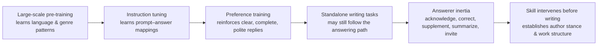

# humanize-writing

> *Make AI write Chinese like an author, not a chatbot.*

`humanize-writing` is a Chinese-generation Skill for local AI tools — Codex, Claude Code, WorkBuddy, TRAE, and others. It adjusts the model's writing path *before* the first sentence lands, reducing answerer inertia, template-spliced structure, mechanical phrasing, and rhetorical excess — while preserving facts, register, constraints, and author intent.

The "AI flavor" in Chinese text rarely comes from typos or bad grammar. The text can be complete, polite, and clear, yet still read like a stretched-out chat reply. The real fix usually happens before the writing begins: the model needs to first assess genre, audience, use case, and material through-line, then compose.

This project distills that pre-composition judgment into a reusable Skill. The goal: Chinese deliverables that feel like authored works, not extended answers.

---

> *让 AI 在第一次动笔时，就按"作品"的方式写中文。*

> `humanize-writing` 是一套面向 Codex、Claude Code、WorkBuddy、TRAE 等本地 AI 工具的中文生成 Skill。它会在正文形成之前调整模型的写作路径，减少回答者惯性、提纲拼接感、机械句式和过度修辞，同时保留事实、语域、限制条件与作者意图。

> 很多"AI 味"并不来自错别字或语法错误。文本可能完整、礼貌、清楚，却仍然像一条被拉长的聊天回复。真正需要处理的地方，通常发生在落笔之前：模型需要先判断文体、读者、使用场景和材料主线，再开始写正文。

> 本项目的目标，是把这套判断过程沉淀成可复用的 Skill，让 AI 生成中文交付文稿时，少一点回答感，多一点作品结构。

---

## Use Cases / 适用场景

**EN** — Suitable for generating or revising these types of Chinese text:

* Technical blogs, WeChat articles, project introductions
* READMEs, API docs, developer documentation, user guides
* Lecture notes, tutorials, learning materials
* Client proposals, project reports, product descriptions
* Reviews, analysis, long-form articles, narratives
* **Academic papers**: journal/conference manuscript writing and polishing — covering register shift, terminology consistency, logical structure, and redundancy control
* Any deliverable-oriented Chinese writing in Codex, Claude Code, WorkBuddy, or TRAE

Usage examples:

```text
Use humanize-writing to write a CSDN blog post. Output a publishable draft directly.
```

```text
Use humanize-writing to rewrite this README so it stands on its own without the chat context.
```

```text
Use humanize-writing to organize this lecture script following the learner's comprehension order.
```

---

**ZH** — 适合用于生成或改写以下中文文本：

* CSDN 技术博客、公众号文章、项目介绍
* README、接口文档、开发文档、使用说明
* 课程讲稿、教程、学习材料
* 客户方案、项目汇报、产品说明
* 评论、分析、长文、叙事文本
* **学术论文**：期刊/会议投稿的写作与润色，涵盖语域切换、术语一致、逻辑结构和冗余控制
* Codex、Claude Code、WorkBuddy、TRAE 等工具中的交付型中文写作任务

使用示例：

```text
使用 humanize-writing 写一篇 CSDN 博客，直接给出可发布成稿。
```

```text
使用 humanize-writing 重写 README，让文档脱离聊天上下文独立成立。
```

```text
使用 humanize-writing 整理这份课程讲稿，按照学生理解顺序组织内容。
```

---

## What Problem It Solves / 它解决什么问题

**EN** — Many AI-generated Chinese drafts look correct yet read like over-polite replies. Common signs:

* Opening by acknowledging the request, closing by offering further assistance
* Overusing corrective sentence frames: *"Not X, but Y"* / *"The key is not A, but B"*
* Fabricating a misunderstanding in the reader, then clarifying it point by point
* Expanding the prompt in order, with no internal progression between paragraphs
* Every section ending with a definition, three bullet points, and a takeaway — same rhythm, same mold
* Heavy on abstract evaluation, light on concrete conditions, actions, details, and results
* The text answers a question well, yet can't stand alone outside the chat window

These phenomena together are what this project calls **answerer inertia** — an observable posture in the text. It is not used to judge authorship or to produce any AI-detection claim.

---

**ZH** — 很多中文 AI 文稿看起来没有明显错误，读起来却像一份过度周到的答复。常见表现包括：

* 开头先确认要求，结尾继续表示愿意协助
* 反复使用 `不是 X，而是 Y`、`不等于`、`关键在于` 一类纠正式句型
* 预设读者犯了错，再逐条澄清
* 严格沿提示词顺序扩写，段落之间缺少作品自身的推进关系
* 每节都以定义、三点列举和原则句收尾，节奏整齐得像同一副模具
* 抽象评价很多，具体条件、动作、细节和结果偏少
* 文章能回答问题，却难以脱离聊天窗口独立成立

这些现象可以合称为 **回答者惯性**。回答者惯性描述的是文本中可观察的姿态，不用于判断作者身份，也不等同于任何 AI 检测结论。

---

## Why Models Default to "Answering" / 为什么模型容易写成"回答"

**EN** — Four forces push models toward the answering posture:

1. **Pre-training on vast text patterns** — Autoregressive LMs learn statistical relationships across words, syntax, genres, and discourse from web-scale corpora. They absorb recurring patterns from forums, Q&A, articles, news, and books — but they don't naturally distinguish between "compose a standalone article" and "reply to a query."

2. **Instruction tuning reinforces the prompt–response bond** — Methods like InstructGPT train on human-written demonstrations and ranked outputs. Models learn to accept tasks, cover requirements, and deliver complete answers — excellent for assistance, but it locks in an answering path for formal writing too.

3. **RLHF rewards "helpful" expression** — Human preference training favors completeness, clarity, politeness, and requirement coverage. These traits, useful in chat, become service-oriented boilerplate when carried into deliverables: anticipating questions, adding background, summarizing, and leaving an open door at the end.

4. **Chat posture leaks into authored work** — When asked to write a tutorial, review, or narrative, the model still receives a "user message." Without establishing an authorial stance and work structure first, it defaults to the familiar path: acknowledge, explain each requirement, wrap up. The result looks complete but depends on the absent chat context.



---

**ZH** — 四种力量把模型推向回答姿态：

1. **预训练学到大量文本模式** — 自回归语言模型从大规模语料中学到词语、句法、文体和篇章之间的统计关系，也会吸收网页、论坛、说明文、新闻、书籍、问答等文本里反复出现的表达模式。预训练赋予模型广泛的续写能力，但不会天然判断当前任务需要一篇独立文章，还是一条针对提问的回复。

2. **指令微调强化"提示—回答"关系** — InstructGPT 的公开方法包含标注者编写理想回答和对多个输出排序两个关键环节。模型因此更擅长接受任务、回应要求和交付完整答案。这让 AI 成为更好的助手，也容易让模型在正式写作中继续沿用答题路径。

3. **人类偏好强化"有帮助"的表达** — 基于人类反馈的强化学习倾向于生成更受评价者认可的输出。完整、清楚、礼貌、覆盖要求，通常会得到更好的评价。这些特征在聊天中有用，进入交付文稿后会形成明显的回答姿态。

4. **对话姿态外溢到成品写作** — 写教程、评论、项目介绍或叙事文本时，模型仍然接收一条"用户消息"。如果任务没有先建立作者站位和作品结构，模型很容易继续使用熟悉路径：先回应提示，再解释每一项要求，最后做总结。文章表面完整，内部仍然依赖聊天上下文。


---

## How the Skill Intervenes / Skill 如何介入首次输出

**EN** —

### 1. Determine the text task

Before generating, assess: what genre, who is the reader, where will the text be used, what should the reader know / believe / do after reading, and which facts, terms, data, constraints, and boundaries must be preserved.

### 2. Establish author stance

User prompts, corrections, and evaluations are first converted into content boundaries, emphasis, tone, and pacing requirements. The final text does not carry over chat confirmations, apologies, corrections, or invitations — and does not expand the prompt sentence by sentence. A viable deliverable should stand alone without the chat history.

### 3. Choose an organizing principle

The model picks a through-line instead of copying the prompt order: exposition can follow phenomenon → cause → condition → consequence; tutorials can follow objective → action → observation → judgment → FAQ; analysis can follow problem → material → reasoning → conclusion; narratives can be driven by character perspective, time, or conflict; project introductions can unfold from subject → audience → capability boundaries → usage path.

### 4. Draft and check

The draft begins from a concrete object, action, contradiction, scene, or conclusion. Abstract evaluations are grounded in conditions, details, and results. Transitions are kept light; key changes and core reasoning are slowed down. The text ends when the information is complete — no service-oriented closing.

A five-layer check before delivery:

1. **Stance layer**: Can the text stand alone without the chat context?
2. **Structure layer**: Is it theme-driven, or does it still read like a prompt expansion?
3. **Information layer**: Any vague backgrounds, value inflation, synonym restating, or fuzzy attribution?
4. **Sentence layer**: Are corrective templates, meta-discourse, and hollow verbs too dense?
5. **Rhythm layer**: Are sentence lengths, paragraph lengths, sentence starters, connectors, and punctuation too uniform?

Checks are risk flags, not word-eradication tools. Definitions, citations, necessary distinctions, and genre-required expressions should remain.

---

**ZH** —

### 1. 确定文本任务

生成前先判断：文体是什么、读者是谁、文本会在哪里使用、读者读完需要知道什么/相信什么/做什么、正文需要保留哪些事实、术语、数据、限制和责任边界。

### 2. 建立作者站位

用户提示、纠正和评价先被转换为内容边界、重点、语气与节奏要求。正文不保留聊天中的确认、致歉、纠正和邀约，也不把用户提示逐条改写成段落。一篇合格的成品应当能够脱离聊天记录独立成立。

### 3. 选择组织原则

模型根据对象选择主线，而不是照抄提示词顺序：说明文沿现象、原因、条件和后果推进；教程沿目标、操作、观察、判断和常见问题推进；分析文本沿问题、材料、推理和结论推进；叙事由人物视角、时间变化或冲突推动；项目介绍从对象、读者、能力边界和使用路径展开。

### 4. 写出并检查首稿

首稿从具体对象、动作、矛盾、场景或结论起笔。抽象评价尽量落到条件、细节和结果上；过渡内容轻写，关键变化和核心推理放慢。信息完成后自然结束。交付前进行五层检查：

1. `站位层`：正文能否脱离聊天上下文独立成立
2. `结构层`：段落是否由主题推动
3. `信息层`：有没有空泛背景、同义复述、价值膨胀和模糊归因
4. `句式层`：纠正式模板、元话语和虚化动词是否过密
5. `节奏层`：句长、段长、句首、连接词和标点是否整齐得失去变化

检查用于发现风险，不是词语清零。定义、引用、必要辨析和文体本身需要的表达应当保留。

---

## Installation / 安装

**EN** — This repo uses the open Agent Skills format (`SKILL.md` + YAML frontmatter). Tools with Agent Skills support can read it directly; tools that only support Rules, Memory, or Custom Instructions can import the `SKILL.md` body.

### Codex

```bash
# Windows PowerShell
git clone https://github.com/Lanqingsong/humanize-writing.git "$env:USERPROFILE\.codex\skills\humanize-writing"

# macOS / Linux
git clone https://github.com/Lanqingsong/humanize-writing.git ~/.codex/skills/humanize-writing
```

### Claude Code

```bash
# Windows PowerShell
git clone https://github.com/Lanqingsong/humanize-writing.git "$env:USERPROFILE\.claude\skills\humanize-writing"

# macOS / Linux
git clone https://github.com/Lanqingsong/humanize-writing.git ~/.claude/skills/humanize-writing
```

See: [Claude Code Skills docs](https://code.claude.com/docs/en/skills)

### WorkBuddy

```bash
# Windows PowerShell
git clone https://github.com/Lanqingsong/humanize-writing.git "$env:USERPROFILE\.workbuddy\skills\humanize-writing"

# macOS / Linux
git clone https://github.com/Lanqingsong/humanize-writing.git ~/.workbuddy/skills/humanize-writing
```

### TRAE

TRAE supports custom Rules and Agents. Options vary by version: import the full repo if Skills import is available; use `SKILL.md` as a user-level or project-level rule otherwise. See: [TRAE IDE](https://www.trae.ai/ide/)

### Other tools

Other tools supporting [Agent Skills](https://agentskills.io/) can also use this repo. `agents/openai.yaml` provides Codex/OpenAI UI metadata only and does not affect other tools reading `SKILL.md`.

---

**ZH** — 本仓库采用 `SKILL.md` 与 YAML frontmatter 组成的开放 Agent Skills 结构。支持 Agent Skills 的工具可以直接读取；只支持 Rules、Memory 或 Custom Instructions 的工具可以导入 `SKILL.md` 正文。

### Codex

```bash
# Windows PowerShell
git clone https://github.com/Lanqingsong/humanize-writing.git "$env:USERPROFILE\.codex\skills\humanize-writing"

# macOS / Linux
git clone https://github.com/Lanqingsong/humanize-writing.git ~/.codex/skills/humanize-writing
```

### Claude Code

```bash
# Windows PowerShell
git clone https://github.com/Lanqingsong/humanize-writing.git "$env:USERPROFILE\.claude\skills\humanize-writing"

# macOS / Linux
git clone https://github.com/Lanqingsong/humanize-writing.git ~/.claude/skills/humanize-writing
```

参考：[Claude Code Skills 文档](https://code.claude.com/docs/en/skills)

### WorkBuddy

```bash
# Windows PowerShell
git clone https://github.com/Lanqingsong/humanize-writing.git "$env:USERPROFILE\.workbuddy\skills\humanize-writing"

# macOS / Linux
git clone https://github.com/Lanqingsong/humanize-writing.git ~/.workbuddy/skills/humanize-writing
```

### TRAE

TRAE 支持自定义 Rules 和 Agent。不同版本入口可能变化：有 Skills 导入功能时可导入整个仓库；只有 Rules 功能时可将 `SKILL.md` 正文作为用户级或项目级规则。参考：[TRAE IDE](https://www.trae.ai/ide/)

### 其他工具

其他支持 [Agent Skills](https://agentskills.io/) 的工具也可以使用本仓库。`agents/openai.yaml` 只提供 Codex/OpenAI 界面元数据，不影响其他工具读取 `SKILL.md`。

---

## Usage / 使用方式

**EN** —

Call the Skill by name:

```text
Use humanize-writing to write a beginner-friendly Chinese tutorial. Output a finished draft.
```

```text
Use humanize-writing to write a project introduction. Establish the through-line first; don't answer my prompt point by point.
```

```text
Use humanize-writing to rewrite this README so it stands alone without the chat context.
```

```text
Use humanize-writing to review and rewrite this paper's method section following academic conventions.
```

Explicit invocation varies by tool (`$humanize-writing`, `/humanize-writing`, etc.). When no explicit mechanism is available, `SKILL.md` can be loaded as a user or project rule.

---

**ZH** —

可以直接点名 Skill：

```text
使用 humanize-writing 写一篇面向初学者的中文教程，直接给出成稿。
```

```text
使用 humanize-writing 写项目介绍。先建立文章主线，不要沿我的提示逐条回答。
```

```text
使用 humanize-writing 重写 README，让它能脱离聊天上下文独立成立。
```

```text
使用 humanize-writing 按学术论文规范审查并改写本文的方法节。
```

各工具的显式调用语法可能是 `$humanize-writing` 或 `/humanize-writing`。没有显式调用机制时，也可将 `SKILL.md` 作为用户规则或项目规则载入。

---

## Audit Script / 可选审计脚本

**EN** — A mechanical audit script is included for scanning long documents for high-risk patterns before delivery:

```bash
python scripts/audit_chinese_ai_style.py path/to/file.md
python scripts/audit_chinese_ai_style.py path/to/file.md --strict
python scripts/audit_chinese_ai_style.py path/to/docs --json
```

The script flags: template opposition, answerer posture, vague openings, promotional tone, mechanical connectors, consecutive short sentences, repeated sentence starters, uniform paragraph length, and residual AI tool markers. It provides risk clues only — no author judgments, no "AI probability" scores.

---

**ZH** — 仓库附带机械审计脚本，用于长文或文件交付前寻找高风险模式：

```bash
python scripts/audit_chinese_ai_style.py path/to/file.md
python scripts/audit_chinese_ai_style.py path/to/file.md --strict
python scripts/audit_chinese_ai_style.py path/to/docs --json
```

脚本会提示以下风险：模板对立、回答者姿态、空泛开场、宣传腔、机械连接、连续短句、重复句首、段落等长、AI 工具残留标记。审计脚本只提供回看线索，不判断作者身份，也不输出所谓 AI 概率。

---

## Boundaries / 方法边界

**EN** — This project adheres to the following boundaries:

* Does not promise to bypass AIGC detectors
* Does not use detection scores to measure writing quality
* Does not infer authorship, academic integrity, or factual truth from writing style
* Does not fabricate "human feel" through typos, broken grammar, invented experiences, or chaotic punctuation
* Does not delete evidence, conditions, qualifiers, or responsibility boundaries in pursuit of fluency
* Does not rewrite source text that must be preserved verbatim
* Does not treat necessary definitions, citations, terminological distinctions, and formal expressions as problems

The goal is to reduce observable template-driven risks, making AI text more deliverable — not to produce unreliable camouflage.

---

**ZH** — 本项目遵守以下边界：

* 不承诺绕过 AIGC 检测器
* 不用检测分数衡量写作质量
* 不根据文风判断作者身份、学术诚信或事实真伪
* 不通过错别字、病句、虚构经历和混乱标点制造"人味"
* 不为追求流畅而删除证据、条件、限定词与责任边界
* 不擅自改写需要逐字保留的来源文本
* 不把必要的定义、引用、术语辨析和正式表达全部视为问题

目标是减少可观察的模板化风险，让 AI 文本更适合交付，而不是制造不可靠的伪装效果。

---

## Project Structure / 项目结构

```text
humanize-writing/
├── SKILL.md
├── README.md
├── LICENSE
├── agents/
│   └── openai.yaml
├── references/
│   ├── patterns.md
│   └── academic-paper-guide.md
└── scripts/
    └── audit_chinese_ai_style.py
```

---

## References / 研究依据

**EN** —

* Brown et al., [Language Models are Few-Shot Learners](https://arxiv.org/abs/2005.14165), 2020.
* Ouyang et al., [Training language models to follow instructions with human feedback](https://arxiv.org/abs/2203.02155), 2022.
* OpenAI, [Aligning language models to follow instructions](https://openai.com/index/instruction-following/), 2022.

These support the mechanism descriptions of pre-training, instruction tuning, and RLHF. "Answerer inertia" and its relationship to corrective writing patterns is a working model used by this project to guide generation and editing.

---

**ZH** —

* Brown et al., [Language Models are Few-Shot Learners](https://arxiv.org/abs/2005.14165), 2020.
* Ouyang et al., [Training language models to follow instructions with human feedback](https://arxiv.org/abs/2203.02155), 2022.
* OpenAI, [Aligning language models to follow instructions](https://openai.com/index/instruction-following/), 2022.

上述资料支持对预训练、指令微调和人类反馈训练的机制说明。"回答者惯性"及其与纠正式文风的关系，是本项目用于指导生成与编辑的工作模型。

---

## Contributing / 参与项目

**EN** — Issues and PRs are welcome, especially for:

* Common patterns of "AI flavor" in Chinese (including academic paper scenarios)
* Genre examples: CSDN posts, READMEs, technical proposals, lecture scripts, academic papers
* Integration experience with Codex, Claude Code, WorkBuddy, TRAE
* New patterns the audit script could detect
* Cases where current rules falsely flag legitimate writing
* Better organizing approaches for deliverable-oriented Chinese writing

This project iterates toward one goal: fewer answering reflexes, more reader-facing composition in AI-generated Chinese deliverables.

---

**ZH** — 欢迎提交 Issue 或 PR，尤其是以下内容：

* 中文 AI 味常见模式（包括学术论文场景）
* CSDN、README、技术方案、课程讲稿、学术论文等文体样例
* Codex、Claude Code、WorkBuddy、TRAE 的适配经验
* 审计脚本可识别的新模式
* 当前规则误伤正常表达的案例
* 更适合中文交付写作的组织方式

项目会围绕一个目标持续迭代：让 AI 生成的中文交付文稿少一点回答感，多一点真正面向读者的组织能力。

---

## Author / 作者

LanQS — [874953727@qq.com](mailto:874953727@qq.com)

## License / 许可证

[MIT License](LICENSE)
